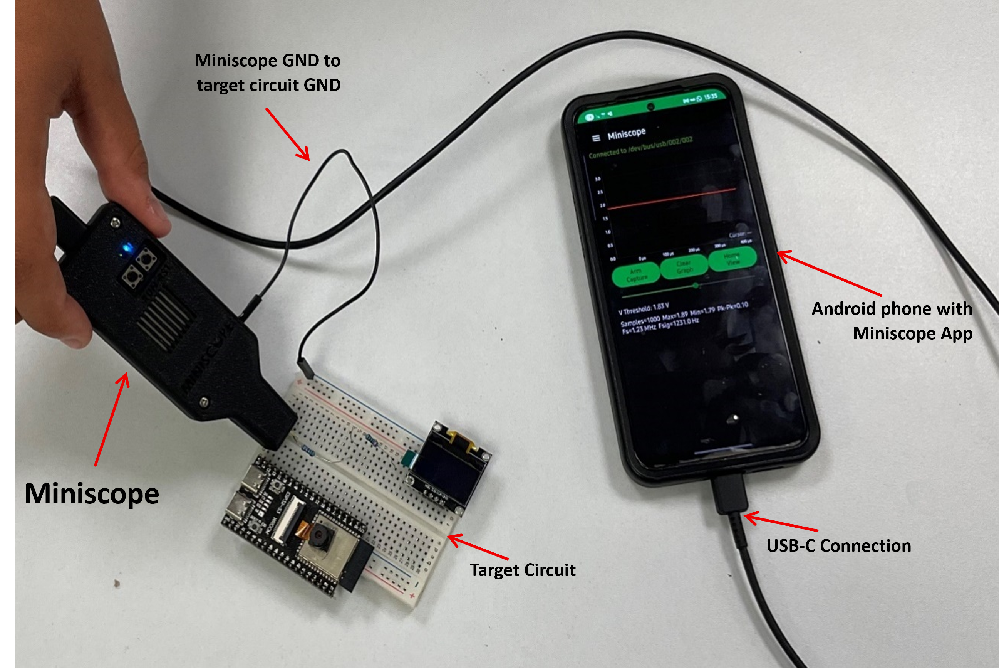
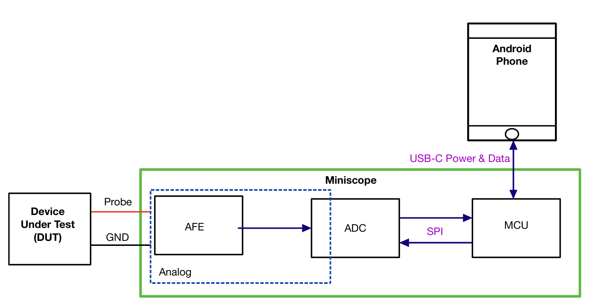
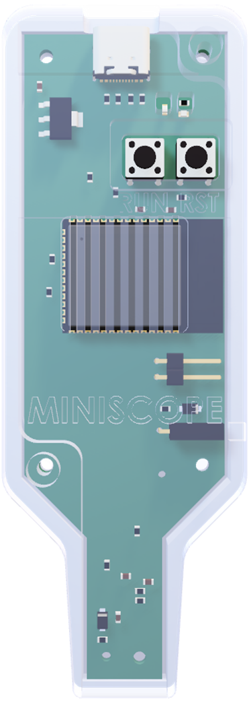
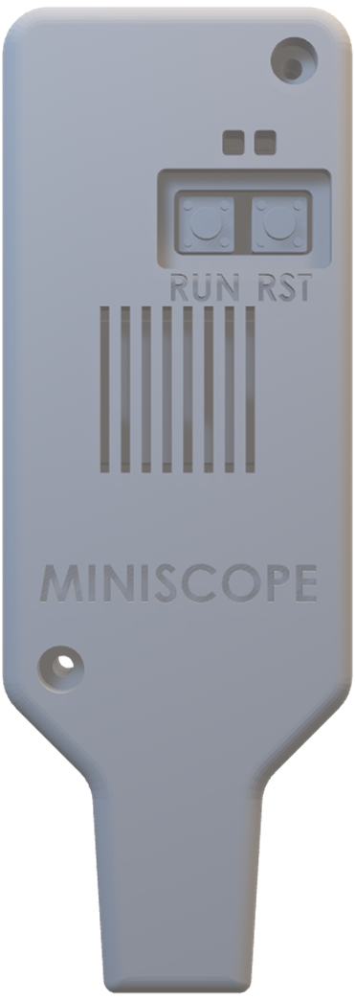
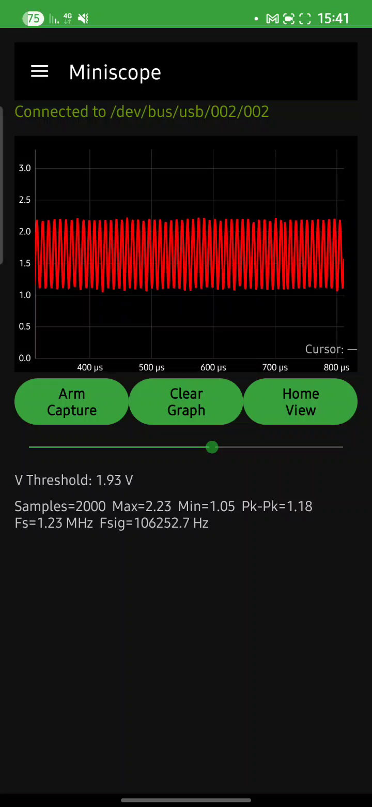
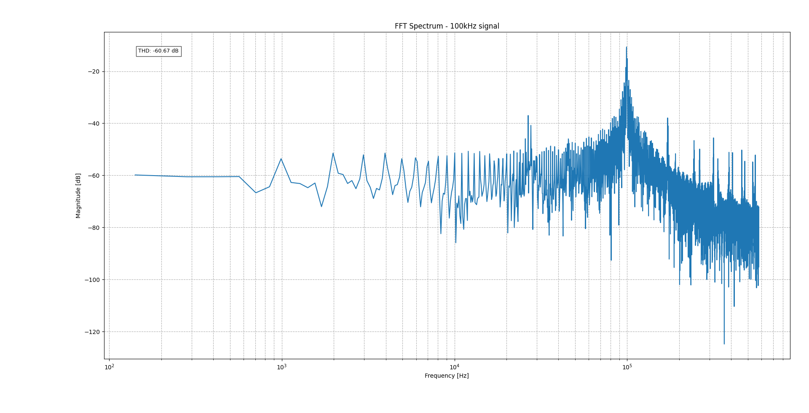

# 🧠 Miniscope – Portable, Low-Cost Oscilloscope

_Affordable • Portable • Educational_

---

## 📸 Project Overview

The **Miniscope** project is a **portable, low-cost handheld trigger-based oscilloscope** designed to capture and analyze high-speed analog signals.

It is based on an **ESP32-S3-WROOM-1-N16R8** microcontroller interfaced with an **AD7276 12-bit ADC**, achieving sampling rates of approximately **1.16 MSPS**.  
Captured data is streamed via **USB-C** to an **Android application**, which provides **trigger-based waveform visualization** and **basic statistical analysis**.

This project demonstrates that oscilloscope-level signal acquisition and visualization can be achieved with **open-source tools** and **off-the-shelf components** for under **$30**.

---

## 🧩 System Architecture

The Miniscope is composed of the following subsystems:

| Subsystem | Description |
|------------|-------------|
| **Analog Front End (AFE)** | Unity-gain OPA365 buffer with RC filter for stable high-speed sampling |
| **ADC** | AD7276 12-bit, up to 3 MSPS, SPI interface |
| **MCU** | ESP32-S3-WROOM-1-N16R8, dual-core, 8 MB flash, 16 MB PSRAM |
| **Interface** | USB-C for data and power |
| **Host App** | Android application (Java) with USB serial interface |
| **Firmware Framework** | ESP-IDF / Arduino with FreeRTOS |

---

## ⚙️ Hardware Design
### ✳️ Key Features

- **AFE**: Low-noise unity-gain buffer (OPA365) with 33 Ω / 1 nF RC network.  
- **ADC**: High-speed SAR ADC (AD7276) sampled over SPI at 40 MHz clock.  
- **Power Supply**: MCP1825ST LDO regulating 5 V → 3.3 V, with analog/digital rail isolation.  
- **Mechanical Design**: Compact 3D-printed pen-style enclosure with accessible probe and GND terminal.  
- **PCB**: 2-layer design with impedance-matched USB-C lines, test points, and isolated AVDD/DVDD.

Estimated cost: **~$29.5** per device.

---

## 🔬 Firmware Implementation

The Miniscope firmware was developed in **PlatformIO (ESP-IDF + Arduino)** using **FreeRTOS**.  
It operates two main tasks running on separate cores:

| Task | Core | Description |
|------|------|--------------|
| **adcTask** | Core 1 | Performs SPI sampling at 40 MHz, handles trigger detection, stores data in PSRAM ring buffer |
| **printingTask** | Core 0 | Handles serial communication, app commands, and data transmission |

### 🧠 Key Firmware Concepts

- **Manual CS toggling** for framed SPI timing (AD7276 compliant).  
- **Double buffering** to avoid blocking during USB transmission.  
- **Configurable trigger** (threshold and edge) via Android commands.  
- **Optimized acquisition** at ~1.159 MSPS verified in-lab.

**Main communication commands:**
TRIGGER
V_THRESHOLD=<value>
TYPE=RISING / TYPE=FALLING

---

## 📱 Android Application

The **Miniscope Android app** provides a real-time waveform visualization and control interface.

### 🧩 Features

- Real-time waveform plotting (MPAndroidChart)
- Adjustable voltage threshold and trigger edge
- Trigger / Clear Graph controls
- Live statistics panel:  
  max, min, peak-to-peak, sampling rate, frequency estimate
- Side drawer menu for advanced settings

### ⚙️ Communication

- USB Serial interface (921600 baud)  
- Asynchronous read thread for sample parsing  
- Commands sent from app → firmware via serial  
- FFT-based frequency estimation (DoubleFFT_1D)

---

## 🔌 Getting Started

### Hardware Setup
1. Connect **Miniscope GND** to target circuit GND.  
2. Plug the Miniscope into an **Android device** using a **USB-C cable**.  
   - Blue LED → Power ON  
3. Ensure target circuit operates within **0–3.3 V** range.

### App Installation
1. Install the **Miniscope APK**.  
2. Open the app – it will automatically detect connected devices.  
3. Grant **USB permission** when prompted.

### Capturing Signals
1. Press **RUN / Arm Capture** (Green LED = Ready).  
2. Adjust **Voltage Threshold** and **Trigger Edge** in the app.  
3. Probe the target signal → waveform appears on screen.

### Best Practices
- Do **not** exceed 3.3 V input.  
- Keep GND wire **short** to reduce noise.  
- For high frequencies (~600 kHz+), expect **aliasing** unless updated anti-aliasing filter capacitor.

---

## 📊 Performance and Validation

| Metric | Measured Value | Notes |
|--------|----------------|-------|
| **Sampling Rate** | 1.159 MSPS | Measured by CS toggling rate |
| **Usable Bandwidth** | ≈ 580 kHz | Verified via frequency sweep |
| **THD** | −55.8 dB | For 100 kHz input sine |
| **SNR** | 29.3 dB | Sufficient for waveform analysis |
| **Resolution** | 12 bits | 0–3.3 V input range |

Practical tests confirmed accurate capture of digital (PWM/I²C/UART) and analog signals.

---

## 🚧 Limitations and Future Work

**Current Limitations**
- Trigger-based acquisition only (no continuous streaming)  
- Limited buffer length (due to PSRAM and timing constraints)  
- No advanced signal processing (averaging/filtering)

**Planned Enhancements**
- Continuous / rolling capture mode  
- App-based waveform overlays and data export  
- Improved analog filtering and calibration  
- USB High-Speed or alternative MCU  
- Enhanced shielding and grounding

---

## 🧠 Educational Value

The Miniscope serves as both a **debugging tool** and an **educational platform**, demonstrating key principles in:
- Mixed-signal hardware design  
- Sampling theory and aliasing  
- Real-time embedded data acquisition  
- Android-embedded system integration  

---

## 🏁 Conclusion

The Miniscope project successfully realizes an **affordable, portable oscilloscope** capable of capturing and visualizing high-speed signals.  
It showcases **system-level optimization** across hardware, firmware, and software — proving that **practical oscilloscope functionality** can be achieved using **open-source, low-cost components**.

It forms a solid foundation for future research and open-source development in **embedded signal measurement** and **educational instrumentation**.

---

## 👥 Authors & Credits

**Developed by:**  
- **Roee Marom**  
- **Or Slopsky**

**Project Supervisor:**  
- **Boaz Mizrachi**

**Institution:**  
Department of Electrical and Computer Engineering, Technion

---

## 🪪 License

This project is released under the **MIT License**.  
See [`LICENSE`](LICENSE) for details.

---

### 📂 Repository Structure
- `/Firmware/`: PlatformIO ESP32-S3 firmware 
- `/Software/`: 
    - `/Android-App/`: Android Studio Java project for mobile visualization and control 
    - `/PC_Python/`: Python scripts for PC interfacing, debugging, and analysis 
---

> _“See signals. Shape tomorrow.”_ — **The Miniscope Team**